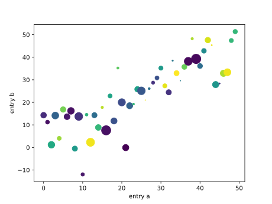
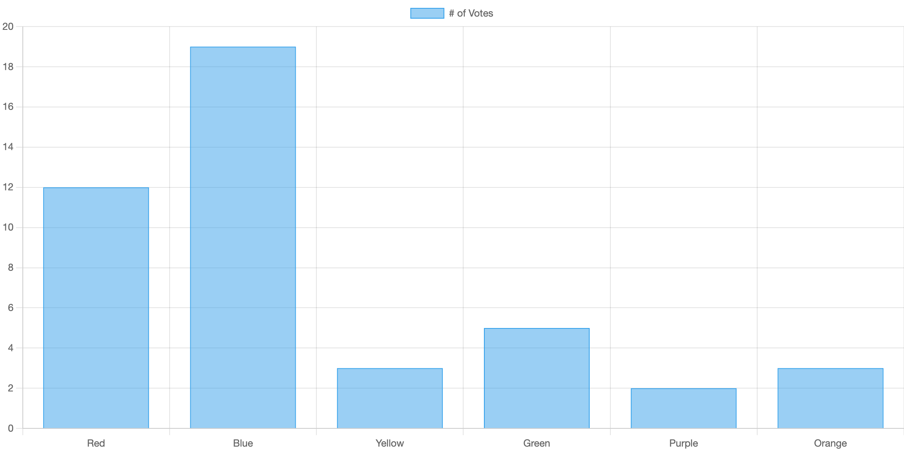

# Output modes

The widget supports different output modes:

[Plain text](#plain-text) •
[JSON table](#json-table) •
[SVG images](#svg-images) •
[HTML fragments](#html-fragments) •
[Inline frame](#inline-frame) •
[Interactive DOM](#interactive-dom)

## Plain text

By default, the widget displays the printed output as text.

Widget:

```html
<codapi-snippet sandbox="python">
</codapi-snippet>
```

Code snippet:

```python
def greet(name):
    print(f"Hello, {name}!")

greet("World")
```

Output:

```
Hello, World!
```

## JSON table

To display a JSON array as a table, set the `output-mode` attribute to `table` and print the JSON array as a string from your code snippet.

Widget:

```html
<codapi-snippet sandbox="python" output-mode="table">
</codapi-snippet>
```

Code snippet:

```python
import json

data = [
    {"id": 11, "name": "Alice"},
    {"id": 12, "name": "Bob"},
    {"id": 13, "name": "Cindy"},
]
print(json.dumps(data))
```

Output:

| id  | name  |
| --- | ----- |
| 11  | Alice |
| 12  | Bob   |
| 13  | Cindy |

## SVG images

To display an image, set the `output-mode` attribute to `svg` and print the image as an SVG string from your code snippet.

Widget:

```html
<codapi-snippet sandbox="python" output-mode="svg">
</codapi-snippet>
```

Code snippet (using `matplotlib`):

```python
import io
import numpy as np
import matplotlib.pyplot as plt

data = {"a": np.arange(50), "c": np.random.randint(0, 50, 50), "d": np.random.randn(50)}
data["b"] = data["a"] + 10 * np.random.randn(50)
data["d"] = np.abs(data["d"]) * 100

plt.scatter("a", "b", c="c", s="d", data=data)
plt.xlabel("entry a")
plt.ylabel("entry b")
plt.show()

stream = io.StringIO()
plt.savefig(stream, format="svg")
print(stream.getvalue())
```

Output:



## HTML fragments

To display HTML content, set the `output-mode` attribute to `html` and print an HTML string from your code snippet.

Widget:

```html
<codapi-snippet sandbox="python" output-mode="html">
</codapi-snippet>
```

Code snippet:

```python
html = """<blockquote>
    I am <em>so</em> <strong>excited</strong>!
</blockquote>"""
print(html)
```

Output:

> I am _so_ **excited**!

You can use any HTML markup except `script`.

## Inline frame

To display a full HTML document in an `iframe`, set the `output-mode` attribute to `iframe` and print a valid HTML document string from your code snippet.

Widget:

```html
<codapi-snippet sandbox="python" output-mode="iframe">
</codapi-snippet>
```

Code snippet:

```python
html = """<html>
<head></head>
<body>Hi there!</body>
</html>"""
print(html)
```

Output:

```
┌───────────┐
│ Hi there! │
└───────────┘
```

The document loads like a regular web page: styles are applied, scripts are executed, and so on.

## Interactive DOM

When using the JavaScript playground (`engine`=`browser`, `sandbox`=`javascript`), you can render a DOM node as an output. To do so, set the `output-mode` attribute to `dom` and return a DOM node from your code snippet.

Widget:

```html
<codapi-snippet engine="browser" sandbox="javascript" output-mode="dom">
</codapi-snippet>
```

Code snippet (using [Chart.js](https://www.chartjs.org/)):

```js
const el = document.createElement("canvas");

new Chart(el, {
    type: "bar",
    data: {
        labels: ["Red", "Blue", "Yellow", "Green", "Purple", "Orange"],
        datasets: [
            {
                label: "# of Votes",
                data: [12, 19, 3, 5, 2, 3],
                borderWidth: 1,
            },
        ],
    },
});

return el;
```

Output:


